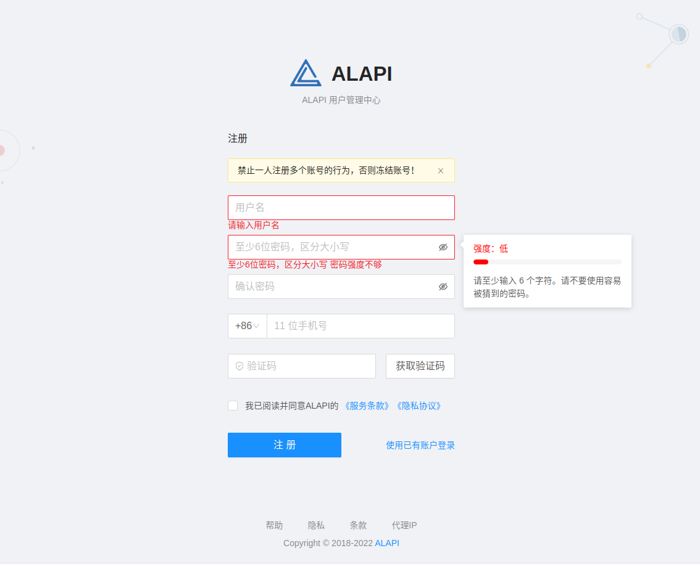
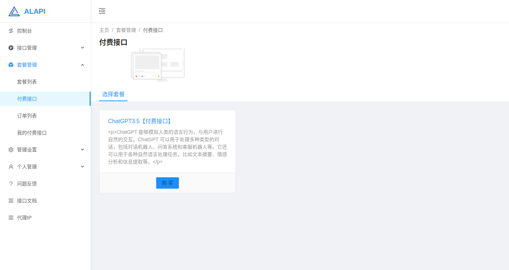
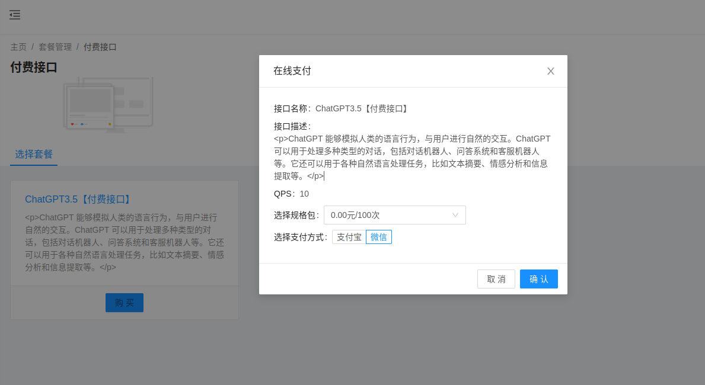
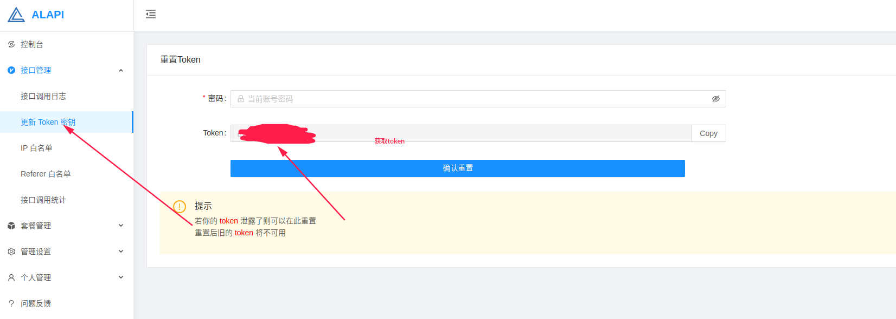
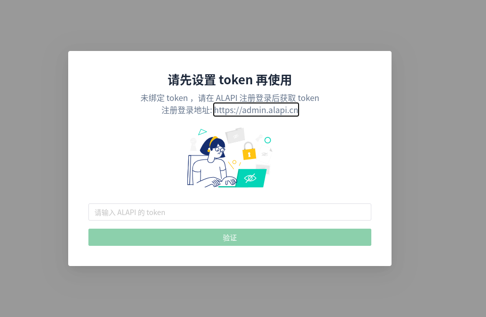

# ChatGPT Web

> 此项目是基于 @ChenZhaoYu 的 [ChatGPT-Web](https://github.com/Chanzhaoyu/chatgpt-web) 项目进行二次开发，支持在国内直接使用，不需要 OpenAI 的账号 和 Key 即可在线使用 ChatGPT 的对话模型


## 使用教程

在线Demo: https://chat.alapi.cn

ALAPI 文档地址 ： https://www.alapi.cn

ALAPI 用户中心 ： https://admin.alapi.cn

首先在 [ALAPI]( https://admin.alapi.cn) 注册一个账号, 然后开通ChatGPT的接口，**支持免费使用！**
然后获取 ALAPI 的 token 密钥 ， 可以在 [demo](https://chat.alapi.cn) 里填入 token ，就可以直接体验ChatGPT了












## 开发编译
适用于自己开发编译，如果不需要可以直接使用 ALAPI 提供的 [demo](https://chat.alapi.cn) 网站进行使用 ChatGPT

### PNPM
如果你没有安装过 `pnpm`
```shell
npm install pnpm -g
```

### 前端
根目录下运行以下命令
```shell
pnpm bootstrap
```

### 前端网页
根目录下运行以下命令
```shell
pnpm dev
```
